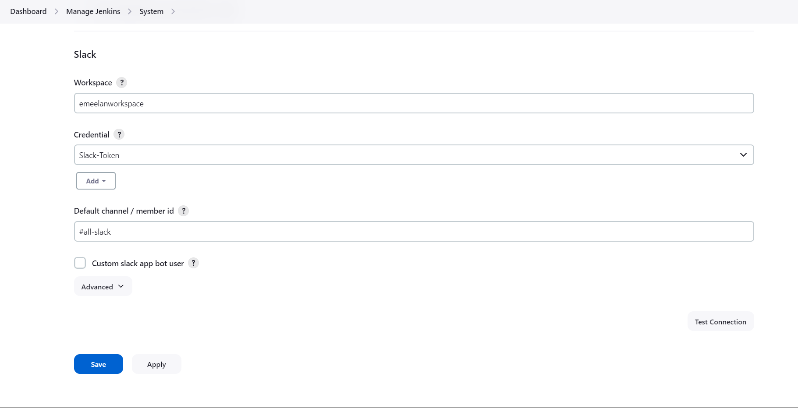
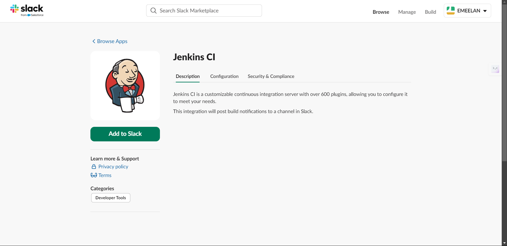
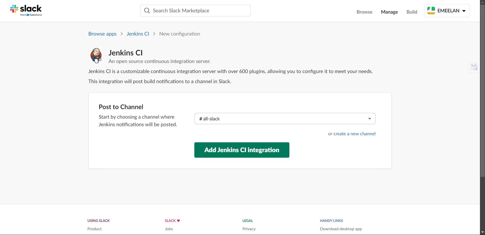
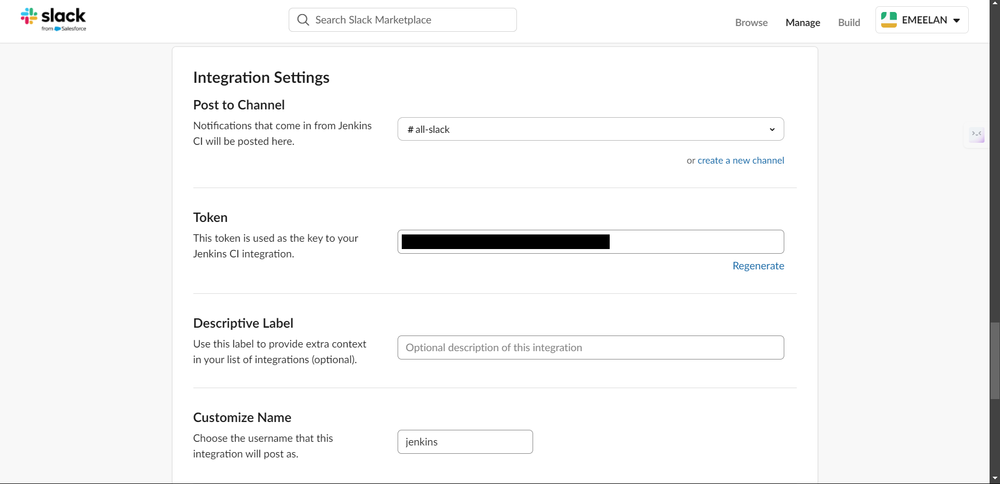

## 📝 Step 1: Configuring Jenkins Pipeline

1. **Navigate to Jenkins Dashboard**
   - From the Jenkins dashboard, click on **New Item** and create a new pipeline project.

2. **Configure the Pipeline**
   - Select **Pipeline** as the project type.

    <!-- Placeholder for configure section image -->

3. **Add Git Repository**
   - In the pipeline configuration, under **Source Code Management (SCM)**, select **Git** and provide your repository link.

    <!-- Placeholder for Git SCM section image -->

4. **Jenkinsfile Setup**
   - Create a `Jenkinsfile` in your repository for the pipeline script:
   
   - For success, create `Jenkinsfilepass`:
   ```groovy
   pipeline {
       agent any
       stages {
           stage('Build') {
               steps {
                   echo 'Building...'
               }
           }
           stage('Test') {
               steps {
                   echo 'Testing...'
               }
           }
           stage('Deploy') {
               steps {
                   echo 'Deploying...'
               }
           }
       }
       post {
           success {
               slackSend (channel: '#all-slack', message: 'Pipeline passed!')
           }
       }
   }
For failure, create Jenkinsfilefail:
```groovy
pipeline {
    agent any
    stages {
        stage('Build') {
            steps {
                echo 'Building...'
            }
        }
        stage('Test') {
            steps {
                echo 'Testing...'
            }
        }
        stage('Deploy') {
            steps {
                echo 'Deploying...'
            }
        }
    }
    post {
        failure {
            slackSend (channel: '#all-slack', message: 'Pipeline failed!')
        }
    }
}
```
## 🛠️ Step 2: Slack Notification Integration

1. **Install Slack Notification Plugin**
   - Navigate to **Manage Jenkins** > **Plugins** > **Available plugins** and search for the Slack Notification plugin. Install it.

    <!-- Placeholder for plugin installation image -->

2. **Configure Slack Settings**
   - Go to **Manage Jenkins** > **Configure System**. Scroll to the **Slack** section and enter your workspace credentials (Webhook URL, Channel, etc.).

    <!-- Placeholder for Slack configuration image -->

3. **Integrate Jenkins with Slack App**
   - In your Slack app, add the **Jenkins CI** integration and generate a token.
   - Copy the token and add it as a secret in Jenkins under **Credentials**.

    <!-- Placeholder for Slack integration image -->
    <!-- Placeholder for Slack integration image -->
    <!-- Placeholder for Slack integration image -->

4. **Save the Configuration**
   - After entering the credentials and token, click **Save** to finalize the integration.


